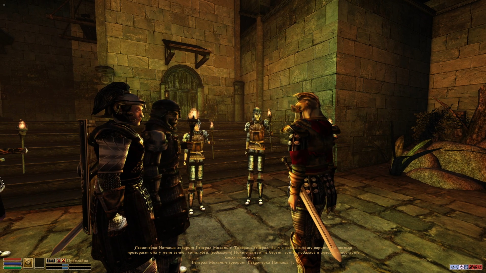
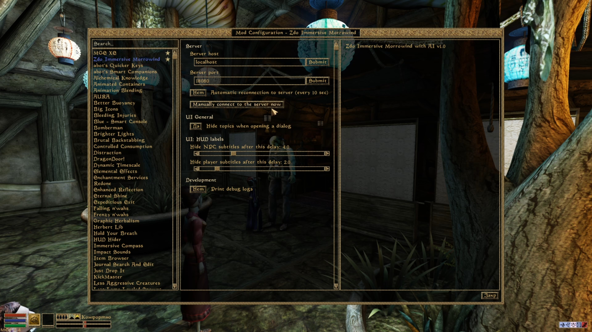
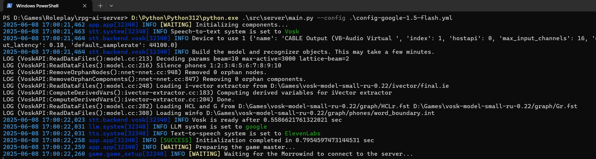

# Server providing AI features for RPGs

This is an experimental solution of integrating LLMs into the good old Morrowind.

What it does in short:
- player can speak with microphone, voice gets recognized (STT = speech-to-text)
- NPC can generate response using power of a chosen LLM
- and finally NPC speaks the generated line (TTS = text-to-speech)

Be aware that description below requires a bit of a technical knowledge from the reader.


NPCs are talking to each other.


MWSE config menu.


Server application launched locally.


# License

GNU GPL v3

# Basics

Currently, mod supports only vanilla Morrowind MWSE (not OpenMW).

How to set it up:

- copy `mwse_mod` directory into `Data Files\MWSE`, or use mod organizer
- prepare `config.yml` (see below how)
- run server (>= Python 3.12)

```sh
D:\Python\Python312\python.exe .\src\server\main.py --config .\config.yml
```

- if everything is alright, server will say

```
<...>
Waiting for the Morrowind to connect to the server...
```

- now it is time for the game to connect to the server. Launch the Morrowind if not yet, or wait as by default mod tries to reconnect every 10 sec

- after it is connected, server will tell you this

```
Client #::1:29227 connected
```

and you will also see a notification in the game

- server will speak to the game and get the initial context. Eventually, you should see something

```
INFO [SUCCESS] Game master started in 6.078705072402954 sec
INFO Happy playing, game master is ready
```

- now you should be good to go: speak to NPC and see the result.

# Setting it up

You have to prepare config file. Use `config.yml.example` as a starting point. Or generate new config using `--write-default-config` command line argument.

Config is big enough. Visit `src\server\app\app_config.py` to check out it in details.

## LLM

Currently supported LLM: Google, Mistral, any OpenAI-compatible, Claude.

I personally find Google Gemini (`gemini-1.5-flash` or `gemini-2.0-flash`) the easiest to use. Here's how to set it up:

- go to Google Cloud Console, create project, select Gemini API, create credentials for it, copy the API key, paste it in the config:

```yaml
llm:
  system:
    type: google

    google:
      api_key: ENTER_HERE
      # model_name: gemini-1.5-flash
      model_name: gemini-2.0-flash
  llm_logger:
    directory: D:\Games\immersive_morrowind_llm_logs
    max_files: 300
```

## Minimal setup

The most bare minimum setup is to have only LLM without STT and TTS - so you would need to chat with NPC only. To set it up, `speech_to_text` and `text_to_speech` in the config set to `dummy` system.


## STT

Currently, server supports only Vosk and Microsoft Speech.

Download Vosk models from here: https://alphacephei.com/vosk/models. For Russian, `vosk-model-small-ru-0.22` works good enough.

For Microsoft Speech, you would need to set up project in Azure Portal https://portal.azure.com, create Speech API key, and paste it in the config.

## TTS

Currently supports only Elevenlabs as in my personal opinion, it is the only service which produces non-robotic speeches, and sounds good. But it should be easy enough to integrate other services.

The setup here is a bit more complex.

1. Get API key and add it to the config.

2. You need to create voices for each pair `(race, gender)`, plus there is a separate voice for `Socucius` as in Russian localization the NPC is voiced by the gloricus voice actor Rogvold Suhoverko.

Create file `morrowind-voices-concat.sh` (the syntax is for Git Bash; for Powershell it should be rewritten):

```sh
#!/bin/bash -x

# RACE="bm"
rm /d/voices-${RACE}.txt;
for f in *.mp3; do echo "file '${PWD}/$f'" | sed 's/\/c\//C:\//'; done > /d/voices-${RACE}.txt;
/d/ffmpeg/bin/ffmpeg.exe -f concat -safe 0 -i /d/voices-${RACE}.txt -c copy /d/concat-${RACE}-full.mp3
/d/ffmpeg/bin/ffmpeg.exe -ss 0 -t 300 -i /d/concat-${RACE}-full.mp3 -c:a copy /d/concat-${RACE}-trimmed.mp3
```

This script gets all mp3 files in the folder you are in. If you are in `Data Files\Sound\Vo\d\m`, then it wlil list all mp3 voiced lines for Dunmer male. Then it merges them alltogether in a single long file, and then trims it to get the first 5 minutes. 5 minutes is good enough for ElevenLabs to operate.

Adjust path to `ffmpeg.exe` in the script accordingly.

3. Now, you need to create voices for each race and gender. Go to `Data Files\Sound\Vo`, and, say for dunmer male: `Data Files\Sound\Vo\d\m`, and run the command:

```sh
RACE=dm /d/dev/morrowind-voices-concat.sh
```

This will generate two files: `/d/concat-dm-full.mp3` and `/d/concat-dm-trimmed.mp3`. Last one is good for using in Elevenlabs: upload it in there.

4. After that, you would need to copy voice ID of the newly created voice, and set it in the config:

```yaml
text_to_speech:
  system:
    type: elevenlabs
    elevenlabs:
      api_key: ENTER_HERE
      language_code: ru
      model_id: eleven_flash_v2_5
      max_wait_time_sec: 10

      voices:
        d_male: ENTER_HERE
```

5. Do this for every single race and gender. After all voices are uploaded, NPC should be able to speak.

### ffmpeg

FFmpeg is optional. It can be used to adjust pitch of the file, and speed it up a bit to avoid too long speeches.

## Database

Database is where server stores all the known context for all used NPCs. Specify the wanted directory to store data in:

```yaml
database:
  directory: D:\Games\immersive_morrowind_db
```

Stored data is 100% readable by a human. Check it out and play with it, tweak some personalities, etc.

Database is read upon starting the server. If you change something in the DB, restart the server.
Restarting server during gameplay is OK.

## Config examples

Here example of my local config, with API keys stripped away:

```yaml
morrowind_data_files_dir: C:\SteamLibrary\steamapps\common\Morrowind\Data Files
language: ru
event_bus:
  consumers: 30
  producers: 30
  system:
    mwse_tcp:
      encoding: cp1251
      port: 18080
    type: mwse_tcp
llm:
  system:
    type: google

    google:
      api_key: AIzaSyCfV_0n8eJxtxS-8mL-<...>
      # model_name: gemini-1.5-flash
      model_name: gemini-2.0-flash
  llm_logger:
    directory: D:\Games\immersive_morrowind_llm_logs
    max_files: 300
log:
  log_to_console: true
  log_to_console_level: info
  log_to_file: true
  log_to_file_level: debug
rpc:
  max_wait_time_sec: 5.0
speech_to_text:
  delayed_stop_sec: 0.5
  system:
    type: vosk

    microsoft_speech:
      key: 81Iu7kzM24T35AhAZykW8SdREfAxrxE<...>
      known_words: Морровинд,Вварденфелл,Кай,Косадес,Балмора,Сейда Нин,Селлус,Гравиус,Ганциэль,Дуар,Сокуциус,Эргалла,Тель,Мора
      language: ru-RU
      region: northeurope

    vosk:
      model_path: D:\Games\vosk-model-small-ru-0.22
      device_index: 0
text_to_speech:
  sync_print_and_speak: false
  output:
    file_name_format: tts_{}.mp3
    max_files_count: 15
  ffmpeg:
    path_to_ffmpeg_exe: D:\ffmpeg\bin\ffmpeg.exe
    target_char_per_sec: 4
    tempo_mul: 0.85
  system:
    type: elevenlabs
    elevenlabs:
      api_key: sk_6b9e37<...>
      language_code: ru
      model_id: eleven_flash_v2_5
      max_wait_time_sec: 10

      voices:
        d_male: LvWai58<...>
        n_male: K7WnR2j<...>
        i_male: WTr0sj9<...>
        h_male: d7Bl30c<...>
        k_male: hxn5s9L<...>
        b_male: vlIHT1xH<...>
        a_male: anHhdfFs<...>
        o_male: UVEi0xIa<...>
        r_male: YFrX86uC<...>
        w_male: wGxrLgF<...>

        d_female: Ewh16Jh<...>
        n_female: 5Evx5<...>
        i_female: lCxYJ<...>
        h_female: gUSChS<...>
        k_female: uqm0t9<...>
        b_female: 9BwM9Z<...>
        a_female: 9484d5<...>
        o_female: bOgn<...>
        r_female: tbemlL<...>
        w_female: DlY<...>

        socucius: 4FOhR<...>
database:
  directory: D:\Games\immersive_morrowind_db
npc_database:
  max_stored_story_items: 250
  max_used_in_llm_story_items: 50
player_database:
  max_stored_story_items: 200
  book_name: Книга Путей
  max_shown_story_items: 50
npc_speaker:
  release_before_end_sec: 2.5
npc_director:
  npc_max_phrases_after_player_hard_limit: 100
  # npc_max_phrases_after_player_hard_limit: 10
  strategy_random:
      npc_phrases_after_player_min: 1
      npc_phrases_after_player_max: 3
      npc_phrases_after_player_min_proba: 0.5
  random_comment_delay_sec: 60
  random_comment_proba: 0.1
  force_sheogorath_level: mad
  can_include_player_in_sheogorath: never
scene_instructions:
  file: D:\Games\immersive_morrowind_manual_instructions.txt
  encoding: cp1251
```

Here's example how to integrate an OpenAPI LLM:

```yaml
llm:
  system:
    type: openai

    openai:
      api_key: sk-proj-nHi39i9a0tom2R<...>
      model_name: gpt-4o
      base_url: https://api.openai.com/v1
```

# FAQ

Can it be integrated with other games (Gothic, Fallout, etc)?\
In theory - yes. One would need to implement "game mod", and adjust "server side" accordingly.

Can it be integrated with OpenMW?\
Currently - no, but technically possible. OpenMW Lua API should be extended to support everything what this mod requires. MWSE is simply superb in this regard as it provides a lot of possibilities. OpenMW can as well, but it needs to be implemented.

Can it be used with other languages?\
Yes. It should be easy enough transition from the technical standpoint.

Is it free?\
The mod itself is opensource under GPLv3.\
Google Gemini can be used for free if you do not reach limits.\
Elevenlabs - you have to pay for it.\
Vosk locally is free.

Can another LLM/STT/TTS system get integrated?\
Yes, it should be easy to do, feel free to check out the code.

Can you introduce the code base a bit?\
Yes. Let's take a look:
```yml
src
    mwse_mod # integration with the Morrowind itself, written in Lua
    server # server itself, written in Python (>= 3.12)
        main.py # entrypoint
        app # second after entrypoint which sets everything up
        eventbus # implements communication between server and mwse_mod
        game # the core part of the server
            data # common data definitions
            i18n # partial support for i18n, not 100% integrated
            service # server is built upon multitude of services
                npc_services # handles NPC actions
                player_services # handles player actions
                providers # some data providers
                story_item # helpers
        llm # abstracted out LLM proxy
        stt # abstracted out STT proxy
        tts # abstracted out TTS proxy
```

Can this be set up as a remote server?\
Yes. It would require splitting server into two parts: local and remote. Local would be listening to the mic, and remote would be communicating with external backends (STT/TTS/LLM). Local part would communicate to the remote, and game would communicate to the local part.

# Authors

Dmitry Zganyaiko https://linkedin.com/in/zdooo
