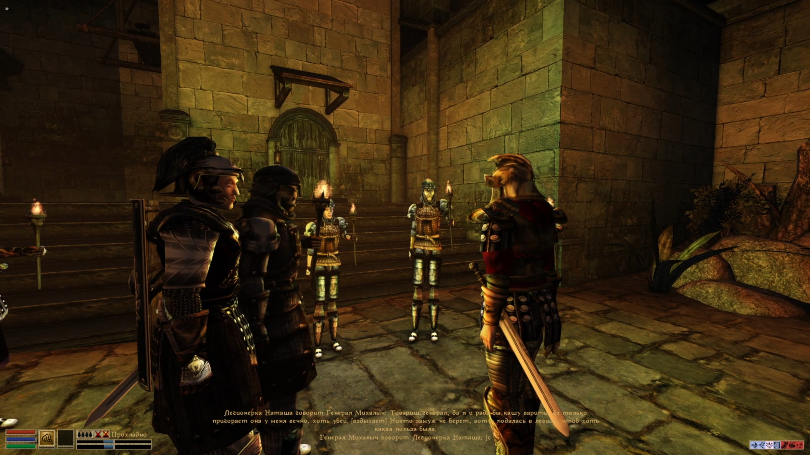
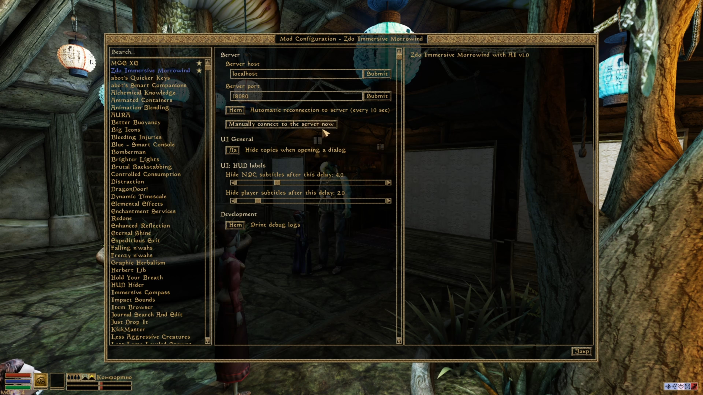
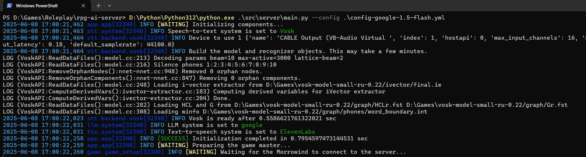

# Server providing AI features for RPGs

---

This repo is ARCHIVED.

Next evolution of this mod will be here https://github.com/drzdo/zdo-rpg-ai

---

This is an experimental solution of integrating LLMs into the good old Morrowind.

What it does in short:
- player can speak with microphone, voice gets recognized (STT = speech-to-text)
- NPC can generate response using power of a chosen LLM
- and finally NPC speaks the generated line (TTS = text-to-speech)

You can even direct a conversation between NPCs, look into `scene_instructions.py`.

🍒 *Для говорящих по-русски - вот плейлист с видосами, как это звучит и выглядит*:\
https://www.youtube.com/watch?v=AzXEMGyHnrY&list=PLMnNOtiaekqkUdzVFybvpACl9h3pCZYnq&index=15


NPCs are talking to each other.


MWSE config menu.


Server application launched locally.

Be aware that description below requires a bit of a technical knowledge from the reader.\
I encourage somebody to prepare a more user-friendly guide :)

# License

GNU GPL v3

Author: Dmitry Zganyaiko https://linkedin.com/in/zdooo

# Basics

Currently, mod supports only vanilla Morrowind MWSE (not OpenMW).

How to set it up:

- copy `mwse_mod` directory into `Data Files\MWSE`, or use mod organizer
- prepare `config.yml` (see below how)
- run server (>= Python 3.12)

```sh
D:\Python\Python312\python.exe .\src\server\main.py --config .\config.yml
```

- if everything is alright, server will say

```
<...>
Waiting for the Morrowind to connect to the server...
```

- now it is time for the game to connect to the server. Launch the Morrowind if not yet, or wait as by default mod tries to reconnect every 10 sec

- after it is connected, server will tell you this

```
Client #::1:29227 connected
```

and you will also see a notification in the game

- server will speak to the game and get the initial context. Eventually, you should see something

```
INFO [SUCCESS] Game master started in 6.078705072402954 sec
INFO Happy playing, game master is ready
```

- now you should be good to go: speak to NPC and see the result.

# Setting it up

You have to prepare config file. Use `config.yml.example` as a starting point. Or generate new config using `--write-default-config` command line argument.

Config is big enough. Visit `src\server\app\app_config.py` to check out it in details.

## LLM

Currently supported LLM: Google, Mistral, any OpenAI-compatible, Claude.

I personally find Google Gemini (`gemini-1.5-flash` or `gemini-2.0-flash`) the easiest to use. Here's how to set it up:

- go to Google Cloud Console, create project, select Gemini API, create credentials for it, copy the API key, paste it in the config:

```yaml
llm:
  system:
    type: google

    google:
      api_key: ENTER_HERE
      # model_name: gemini-1.5-flash
      model_name: gemini-2.0-flash
  llm_logger:
    directory: D:\Games\immersive_morrowind_llm_logs
    max_files: 300
```

## Minimal setup

The most bare minimum setup is to have only LLM without STT and TTS - so you would need to chat with NPC only. To set it up, `speech_to_text` and `text_to_speech` in the config set to `dummy` system.


## STT

Currently, server supports only Vosk, Microsoft Speech and Whisper.

Download Vosk models from here: https://alphacephei.com/vosk/models. For Russian, `vosk-model-small-ru-0.22` works good enough.

For Microsoft Speech, you would need to set up project in Azure Portal https://portal.azure.com, create Speech API key, and paste it in the config.

For Whisper, use this config template:

```yml
  system:
    type: whisper

    whisper:
      device_index: 0
      model_name: base
      language: ru
      device: cuda
      initial_prompt: Балмора Сейда-Нин Дагот Ур данмер Кай Косадес Вварденфелл
```

## TTS

Currently supports only Elevenlabs as in my personal opinion, it is the only service which produces non-robotic speeches, and sounds good. But it should be easy enough to integrate other services.

The setup here is a bit more complex.

1. Get API key and add it to the config.

2. You need to create voices for each pair `(race, gender)`, plus there is a separate voice for `Socucius` as in Russian localization the NPC is voiced by the gloricus voice actor Rogvold Suhoverko.

Create file `morrowind-voices-concat.sh` (the syntax is for Git Bash; for Powershell it should be rewritten):

```sh
#!/bin/bash -x

# RACE="bm"
rm /d/voices-${RACE}.txt;
for f in *.mp3; do echo "file '${PWD}/$f'" | sed 's/\/c\//C:\//'; done > /d/voices-${RACE}.txt;
/d/ffmpeg/bin/ffmpeg.exe -f concat -safe 0 -i /d/voices-${RACE}.txt -c copy /d/concat-${RACE}-full.mp3
/d/ffmpeg/bin/ffmpeg.exe -ss 0 -t 300 -i /d/concat-${RACE}-full.mp3 -c:a copy /d/concat-${RACE}-trimmed.mp3
```

This script gets all mp3 files in the folder you are in. If you are in `Data Files\Sound\Vo\d\m`, then it wlil list all mp3 voiced lines for Dunmer male. Then it merges them alltogether in a single long file, and then trims it to get the first 5 minutes. 5 minutes is good enough for ElevenLabs to operate.

Adjust path to `ffmpeg.exe` in the script accordingly.

3. Now, you need to create voices for each race and gender. Go to `Data Files\Sound\Vo`, and, say for dunmer male: `Data Files\Sound\Vo\d\m`, and run the command:

```sh
RACE=dm /d/dev/morrowind-voices-concat.sh
```

This will generate two files: `/d/concat-dm-full.mp3` and `/d/concat-dm-trimmed.mp3`. Last one is good for using in Elevenlabs: upload it in there.

4. After that, you would need to copy voice ID of the newly created voice, and set it in the config:

```yaml
text_to_speech:
  system:
    type: elevenlabs
    elevenlabs:
      api_key: ENTER_HERE
      language_code: ru
      model_id: eleven_flash_v2_5
      max_wait_time_sec: 10

      voices:
        d_male: ENTER_HERE
```

5. Do this for every single race and gender. After all voices are uploaded, NPC should be able to speak.

### ffmpeg

FFmpeg is optional. It can be used to adjust pitch of the file, and speed it up a bit to avoid too long speeches.

## Database

Database is where server stores all the known context for all used NPCs. Specify the wanted directory to store data in:

```yaml
database:
  directory: D:\Games\immersive_morrowind_db
```

Stored data is 100% readable by a human. Check it out and play with it, tweak some personalities, etc.

Database is read upon starting the server. If you change something in the DB, restart the server.
Restarting server during gameplay is OK.

# FAQ

Q. Can it be integrated with other games (Gothic, Fallout, etc)?\
A. In theory - yes. One would need to implement "game mod", and adjust "server side" accordingly.

Q. Can it be integrated with OpenMW?\
A. Currently - no, but technically possible. OpenMW Lua API should be extended to support everything what this mod requires. MWSE is simply superb in this regard as it provides a lot of possibilities. OpenMW can as well, but it needs to be implemented.

Q. Can it be used with other languages?\
A. Yes. It should be easy enough transition from the technical standpoint.

Q. Is it free?\
A. The mod itself is opensource under GPLv3.\
Google Gemini can be used for free if you do not reach limits.\
Elevenlabs - you have to pay for it.\
Vosk locally is free.

Q. Can I modify the mod, create a fork?\
A. Yes, of course.

Q. Can I upload this mod or changed version to the Nexus (or any other platform)?\
A. Yes. Please include the link to this repository.

Q. Is there a more user-friendly guide?\
A. I encourage somebody from the communite to prepare it. If you do - please send me the link, I'll attach it here.

Q. Can another LLM/STT/TTS system get integrated?\
A. Yes, it should be easy to do, feel free to check out the code.

Q. Can you introduce the code base a bit?\
A. Yes. Let's take a look:
```yml
src
    mwse_mod # integration with the Morrowind itself, written in Lua
    server # server itself, written in Python (>= 3.12)
        main.py # entrypoint
        app # second after entrypoint which sets everything up
        eventbus # implements communication between server and mwse_mod
        game # the core part of the server
            data # common data definitions
            i18n # partial support for i18n, not 100% integrated
            service # server is built upon multitude of services
                npc_services # handles NPC actions
                player_services # handles player actions
                providers # some data providers
                story_item # helpers
        llm # abstracted out LLM proxy
        stt # abstracted out STT proxy
        tts # abstracted out TTS proxy
```

Q. Can this be set up as a remote server?\
A. Yes. It would require splitting server into two parts: local and remote. Local would be listening to the mic, and remote would be communicating with external backends (STT/TTS/LLM). Local part would communicate to the remote, and game would communicate to the local part.

# Examples

## Config example

Example of the most basic config, only with Gemini and no TTS/STT:

```yaml
morrowind_data_files_dir: C:\SteamLibrary\steamapps\common\Morrowind\Data Files
language: ru
event_bus:
  consumers: 30
  producers: 30
  system:
    mwse_tcp:
      encoding: cp1251
      port: 18080
    type: mwse_tcp
llm:
  system:
    type: google

    google:
      api_key: AIzaSyCfV_0n8eJxtxS-8mL-<...>
      # model_name: gemini-1.5-flash
      model_name: gemini-2.0-flash
  llm_logger:
    directory: D:\Games\immersive_morrowind_llm_logs
    max_files: 300
log:
  log_to_console: true
  log_to_console_level: info
  log_to_file: true
  log_to_file_level: debug
rpc:
  max_wait_time_sec: 5.0
speech_to_text:
  delayed_stop_sec: 0.5
  system:
    type: dummy
text_to_speech:
  sync_print_and_speak: false
  output:
    file_name_format: tts_{}.mp3
    max_files_count: 15
  system:
    type: dummy
database:
  directory: D:\Games\immersive_morrowind_db
npc_database:
  max_stored_story_items: 250
  max_used_in_llm_story_items: 50
player_database:
  max_stored_story_items: 200
  book_name: Книга Путей
  max_shown_story_items: 50
npc_speaker:
  release_before_end_sec: 2.5
npc_director:
  npc_max_phrases_after_player_hard_limit: 0
  strategy_random:
      npc_phrases_after_player_min: 0
      npc_phrases_after_player_max: 0
      npc_phrases_after_player_min_proba: 0.0
  random_comment_delay_sec: 120
  random_comment_proba: 0.0
scene_instructions: null
```

Here example of my local config, with Gemini+Vosk+ElevenLabs, with API keys stripped away:

```yaml
morrowind_data_files_dir: C:\SteamLibrary\steamapps\common\Morrowind\Data Files
language: ru
event_bus:
  consumers: 30
  producers: 30
  system:
    mwse_tcp:
      encoding: cp1251
      port: 18080
    type: mwse_tcp
llm:
  system:
    type: google

    google:
      api_key: AIzaSyCfV_0n8eJxtxS-8mL-<...>
      # model_name: gemini-1.5-flash
      model_name: gemini-2.0-flash
  llm_logger:
    directory: D:\Games\immersive_morrowind_llm_logs
    max_files: 300
log:
  log_to_console: true
  log_to_console_level: info
  log_to_file: true
  log_to_file_level: debug
rpc:
  max_wait_time_sec: 5.0
speech_to_text:
  delayed_stop_sec: 0.5
  system:
    type: vosk

    microsoft_speech:
      key: 81Iu7kzM24T35AhAZykW8SdREfAxrxE<...>
      known_words: Морровинд,Вварденфелл,Кай,Косадес,Балмора,Сейда Нин,Селлус,Гравиус,Ганциэль,Дуар,Сокуциус,Эргалла,Тель,Мора
      language: ru-RU
      region: northeurope

    vosk:
      model_path: D:\Games\vosk-model-small-ru-0.22
      device_index: 0
text_to_speech:
  sync_print_and_speak: false
  output:
    file_name_format: tts_{}.mp3
    max_files_count: 15
  ffmpeg:
    path_to_ffmpeg_exe: D:\ffmpeg\bin\ffmpeg.exe
    target_char_per_sec: 4
    tempo_mul: 0.85
  system:
    type: elevenlabs
    elevenlabs:
      api_key: sk_6b9e37<...>
      language_code: ru
      model_id: eleven_flash_v2_5
      max_wait_time_sec: 10

      voices:
        d_male: LvWai58<...>
        n_male: K7WnR2j<...>
        i_male: WTr0sj9<...>
        h_male: d7Bl30c<...>
        k_male: hxn5s9L<...>
        b_male: vlIHT1xH<...>
        a_male: anHhdfFs<...>
        o_male: UVEi0xIa<...>
        r_male: YFrX86uC<...>
        w_male: wGxrLgF<...>

        d_female: Ewh16Jh<...>
        n_female: 5Evx5<...>
        i_female: lCxYJ<...>
        h_female: gUSChS<...>
        k_female: uqm0t9<...>
        b_female: 9BwM9Z<...>
        a_female: 9484d5<...>
        o_female: bOgn<...>
        r_female: tbemlL<...>
        w_female: DlY<...>

        socucius: 4FOhR<...>
database:
  directory: D:\Games\immersive_morrowind_db
npc_database:
  max_stored_story_items: 250
  max_used_in_llm_story_items: 50
player_database:
  max_stored_story_items: 200
  book_name: Книга Путей
  max_shown_story_items: 50
npc_speaker:
  release_before_end_sec: 2.5
npc_director:
  npc_max_phrases_after_player_hard_limit: 100
  # npc_max_phrases_after_player_hard_limit: 10
  strategy_random:
      npc_phrases_after_player_min: 1
      npc_phrases_after_player_max: 3
      npc_phrases_after_player_min_proba: 0.5
  random_comment_delay_sec: 60
  random_comment_proba: 0.1
  force_sheogorath_level: mad
  can_include_player_in_sheogorath: never
scene_instructions:
  file: D:\Games\immersive_morrowind_manual_instructions.txt
  encoding: cp1251
```

Here's example how to integrate an OpenAI LLM :

```yaml
llm:
  system:
    type: openai

    openai:
      api_key: sk-proj-nHi39i9a0tom2R<...>
      model_name: gpt-4o
      base_url: https://api.openai.com/v1
      max_tokens: 1024 # optional
      temperature: 0.7 # optional
```

You can also plug in local LLM via the same OpenAI protocol:

```yaml
llm:
  system:
    type: openai

    openai:
      api_key: ""
      model_name: ""
      base_url: http://localhost:12345
      max_tokens: 1024
      temperature: 0.7
```

## Directing

With this mod, you can direct a scene, conversation between NPCs with a script with simple instructions.


<details>
<summary>Here's example of a scene directing instructions for the first section of this video https://www.youtube.com/watch?v=AzXEMGyHnrY (Imperial General checks out the fort)</summary>

```ini
poi travel,уйти домой,-6145,-18464,994
poi activate,уйти внутрь форта,-5062,-18124,1096,ex_imp_loaddoor_03
poi activate,уйти играть в нарды,-4473.43,-17797.74,1242.98,Ex_imp_loaddoor_02

капитан всс скажи, что генерал прибыл сюда с проверкой. Представь генерала легионерам.
генерал подойти к капитану, всс поздоровайся и поприветствуй солдат. Скажи, что пришел всех разъебывать.
капитан подойди к михалычу и всс представь его
капитан подойди к наташе и всс представь ее
капитан подойди к генералу, всс представь оставшихся солдат и спроси генерала что тот думает
ашхан всс поприветствуй генерала здравия желаю блять и скажи что-нибудь эдакое
генерал всс прокомментируй беспорядок в рядах и слабось выправки

hold
генерал подойди к вите, спроси а хули эльф делает в легионе, пусть он магию свою кастует в башнях, где маги дрыщи геморрой насиживают за книжками
капитан всс ответить, что витя охуенный боец
витя всс ответь, что ты вертел всю магию, и ты всю жизнь хотел быть босмером, чтобы стрелять из лука. всс скажи что генерал нвах и что вам тут виднее в морровинде как надо дела делать. в киродииле все блять блестит и сверкает, а в вварденфелле сука пепел ебучий в ноздри лезет

hold
капитан всс прикажи вите блять чтобы он не называл генерала нвахом, что это за блятство
генерал всс ответь, что субординацию надо подддерживать, однако то что генерал нвах это правда, ведь он из киродиила
капитан всс скажи, а вообще что твои бойцы самые отборные и лучшие, хоть и чуть странные
генерал всс спроси, а что наташа женщина делает в легионе, ей бы кашу готовить дома
наташа всс ответь, что ты кашу готовила, но нихуя не получается и всегда пригорает. никто в замуж не берет, поэтому ты в легион пошла.

hold
петя всс скажи что ты ебал такую проверки и такую сдужбу, лучше блять в хлаалу работать, там хоть деньги платят нормальные и не ебут бестолку
петя уйди внутрь форта и добавь к ответу trigger_poi_1
генерал подойди к капитану, всс пошли его НАХУЙ, скажи, что это сброд, и так нельзя
капитан ответь, что пусть генерал сам блять покомандует
ашхан всс скажи, что ты впервые видишь генерала живого, пиздец как ты рад

hold
генерал подойди к ашхану,всс похвали бойца за бойкий нрав. Но потом принюхайся, и всс разъеби его за запах - будто он не мылся блять месяц.
генерал подойди к капитану и спроси, а хули бойцы воняют, у вас есть бани или нет?
капитан всс ответь, что ты вообще не в курсе, что ты дома купаешься в теплой ванной.
наташа всс скажи, что наконец то блять кто-то интересуется бойцама по настоящему, а то ведь не моются они неделями.
саша всс скажи, что капитан бульба не живет жизнью части пес, в ванне блять купается
генерал всс отметь, что это пиздец, бульба какого хуя

hold
ашхан всс порадуйся что бля мыться будете наконец-то ура
саша всс скажи, что может капитану лучше принести своего пенистого мыла своим солдатам, а ты хули он зажимает его
генерал всс ответь, что солдатам не пристало нежиться, и пользоваться мылом с пеной. но один раз в честь того, что генерал приехал - можно.
капитан всс ответь, что бля ладно сейчас принесешь мыла

hold
генерал всс скажи, что ты заебался пиздец с такими солдафонами
генерал всс скажи, что ты уходишь нахуй в форт и добавь в ответе trigger_poi_1
капитан всс скажи, что ты заебался и уходишь нахуй домой купаться в ванной и добавь в ответе trigger_poi_0

hold
ашхан всс предложи всем выпить и поставь 3 бутылки бренди
витя всс скажи, что это пиздец и ты пойдешь служить в хлаалу
наташа всс скажи, что пойдешь с орком бухать, нахер такую службу

hold
витя всс скажи, что ты идешь спать и добавь в ответ trigger_poi_2
наташа всс скажи, что ты идешь бухать с орком, все равно генерал до утра не явится и добавь в ответ trigger_poi_2
ашхан всс скажи, что ты тебе генерал понравился, может его позвать бухать? Да не ладно, без него обойдемся и добавь в ответ trigger_poi_2
саша всс скажи, во пиздец легион, куда я попал, пойду спать и добавь к ответу trigger_poi_1

наташа всс скажи, что ты пойдешь сашку найдешь
наташа добавь к ответу trigger_poi_1
ашхан всс эх наташка ну пойду я с тобой и в ответ добавь trigger_poi_1
```
</details>


<details>
<summary>Here's example of a scene directing instructions for the forth section of this video https://www.youtube.com/watch?v=AzXEMGyHnrY (Krassius Kurio, and Suran's brothel)</summary>

```ini
poi activate,зайти внутрь,53577,-49737,315,hlaalu_loaddoor_02
poi travel,подойти к бару,-274,-274,7
poi travel,подойти посмотреть на танцовщиц,268,-248,7
poi travel,стать в центре комнаты,-24,-262,7
poi activate,выйти наружу,-256,128,128,in_hlaalu_loaddoor_01

курио всс скажи, ну что Губерончик, что давно уже спонсируешь школу искусств в Суране и что пришло время проверить, хули там происходит в этой школе.
курио всс скажи ну давай, заходим в дверь в школу, и добавь trigger_poi_0

hold

курио всс подойди к бару и осмотри происходящее. Тут танцуют три почти голые танцовщицы, кругом разбросана скума, и пахнет травкой - всс прокомментируй это. Скажи, что ты охереваешь.
хельвиан всс поздоровайся с Курио и скажи, что он был её самый лучший учитель искусств, и что вот она теперь тут зарабатывает.
курио всс спроси, а что что это за хиньярси такая стоит?
хиньярси всс скажи, что местные любят канджиток, вот я тут тоже зарабатываю стою

hold

курио всс так ну давайте посмотрим и добавь trigger_poi_2
курио всс прокомментируй красоток, скажи что тебе особенно нравится черненькая Каминда, ух шоколадка
курио всс поговори с местными посетителями

hold

курио всс скажи, что ты вообще не такое спонсировал, и ожидал тут увидеть... нечто более... привычное
руна всс ответь, что обычное искусство ныне дешево стоит, особенно когда много нвахов понаехало - все хотят простого и чтобы цепляло с первого раза

hold

курио всс скажи, что кстати, у тебя ведь есть пьеса которую ты мечтаешь поставить, но не можешь найти актеров
курио всс скажи что пьеса эта - похотливая аргнонианская дева. Спроси кто хочет из местных порепетировать?

hold
курио всс скажи, что там есть две роли - знатный господин и его служанка.

hold
курио всс скажи, что пусть роль знатного господина читает мувис моран
мувис всс стесняясь, колеблясь - придумай причину почему - но согласись
всс всс скажи, а раз аргониан у нас нет, то пусть Каминда читает роль служанки
каминда всс стесняясь, колеблясь - придумай причину почему - но согласись

снорри всс скажи что мувис нихуя не годится на роли, он же задрот и заикается через слово. Скажи что а вот я бы был бы преотличнейшим знатным господином. Курио дай мне попробовать эту роль!
хельвиан всс посмейся со снорри
курио всс скажи, хм, интересная идея, и в правду. Спроси у мувиса не против ли он?
мувис всс кратко скажи, что нет, пусть снорри берет роль
курио всс скажи ну и отлично

hold
каминда выйди с подиума и добавь trigger_poi_2

hold

курио всс скажи, что даешь текст ролей Каминде и Снорри. И спроси готовы ли они
каминда всс ответь что готова
снорри всс ответь что готова
хиньярси всс скажи, что пиздец такого не было никогда в этом борделе... мм школе искусств
курио всс скажи так хорош базарить, и дай команду НАЧАЛИ!

каминда всс прочитай текст роли служанки: Разумеется, нет, добрый сэр! Я здесь только для того, чтобы убрать ваши комнаты.
снорри всс прочитай текст роли господина: И это всё, ради чего ты пришла, малышка? Мои комнаты?
каминда всс прочитай текст роли служанки:Я в толк не возьму, на что вы намекаете, хозяин. Я всего лишь бедная аргонианская служанка.
курио всс останови всех, и скажи чтобы они начали заново, так не пойдет. Пусть читают роли как есть, без своих комментариев.
каминда всс извинись, и скажи что готова
снорри всс извинись, и скажи что готов читать текст без выебонов

каминда скажи один в один: Разумеется, нет, добрый сэр! Я здесь только для того, чтобы убрать ваши комнаты.
снорри скажи один в один: И это всё, ради чего ты пришла, малышка? Мои комнаты?
каминда скажи один в один:Я в толк не возьму, на что вы намекаете, хозяин. Я всего лишь бедная аргонианская служанка.
снорри скажи один в один: Ну конечно же, моя пышечка. И очень хорошенькая. Такие сильные ноги и красивый хвост.
каминда скажи один в один:Вы смущаете меня, сэр!
снорри скажи один в один: Не бойся. Со мной ты в безопасности.
каминда скажи один в один: Мне надо закончить уборку, сэр. Хозяйка мне голову оторвёт, если я не закончу всё вовремя!
снорри скажи один в один: Уборку, да? У меня есть кое-что для тебя. Вот, отполируй мое копьё.
каминда скажи один в один: Но оно такое большое! Это может занять у меня всю ночь!
снорри скажи один в один: У нас с тобой полно времени, моя милая. Полно времени.

хиньярси всс посмейся очень коротко с копья

курио всс скажи Каминде КОНЕЦ СЦЕНЫ УРРРАА получилось
руна всс скажи что думаешь о пьесе
курио порадуйся с Снорри насколько охеренно получилось

hold

курио скажи губерону что ты доволен этой школой и будешь её спонсировать дальше. А пьесу поставим в театре в вивеке через неделю. снорри и Каминда - оба к Курио на аудиенцию завтра!
снорри стесняясь согласись
Каминда всс скажи о да Крассиус я буду рада быть там

курио всс скажи ну и славно всем пока ребята я ушёл спать. скажи Губерон пойдем уже поздно, нам ещё силт страйдера ловить
курио попрощайся и добавь trigger_poi_4

курио всс скажи губерону что ты очень доволен крайне неожиданным результатом. Каминда просто восхитительно, а Снорри - ты только глянь на его бедра, уух.
курио всс скажи губерону что ты предвкушаешь завтрашний день, и визит будущи несомненно великих актеров Морровинда, а может и всего Тамриэля!
```
</details>
